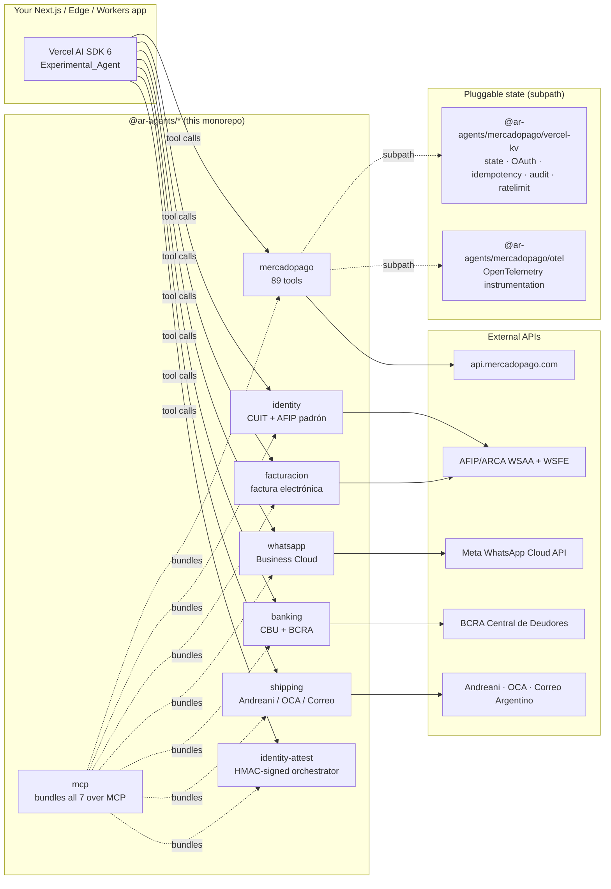

# ar-agents

> **Open infrastructure for AI societies in Argentina.** Built for agents that need to incorporate, operate, pay, invoice, attest identity, and leave auditable logs under Argentine rails.

[](https://github.com/ar-agents/ar-agents/actions/workflows/ci.yml)
[](https://scorecard.dev/viewer/?uri=github.com/ar-agents/ar-agents)
[](https://socket.dev/npm/package/@ar-agents/mercadopago)
[](./LICENSE)
[](https://www.npmjs.com/package/@ar-agents/mercadopago)
[](https://www.npmjs.com/package/@ar-agents/mercadopago)
[](https://bundlephobia.com/package/@ar-agents/mercadopago)
[](https://arethetypeswrong.github.io/?p=@ar-agents/mercadopago)
[](https://docs.npmjs.com/generating-provenance-statements)
[](https://glama.ai/mcp/servers/ar-agents/ar-agents)

`ar-agents` is an open-source toolkit for Argentine AI societies: npm
packages, RFCs, registry, demos, and audit primitives that let agents operate
through ARCA/AFIP, IGJ/GDE/TAD, banking, payments, WhatsApp, Boletín Oficial,
and other local systems. Mercado Pago is one integration inside the stack, not
the project scope.

The most mature package remains [`@ar-agents/mercadopago`](./packages/mercadopago),
a Mercado Pago Agent Toolkit for the [Vercel AI SDK](https://ai-sdk.dev) 6
`Experimental_Agent`, with typed tools across the agent-relevant Mercado Pago
API surface:

> Payments · Subscriptions · Checkout Pro · Marketplace OAuth · Order Management ·
> Customers · Cards · Cuotas · QR · 3DS · Point devices · Stores+POS ·
> Account/Balance/Settlements · Webhooks · Disputes · Lookups · Bank Accounts

Edge Runtime. Vercel KV adapters for state, OAuth, idempotency, and audit.
OpenTelemetry instrumentation. Deterministic idempotency by default.
Programmatic HITL on irreversible operations.

```bash
pnpm add @ar-agents/mercadopago ai zod
```

[](https://vercel.com/new/clone?repository-url=https%3A%2F%2Fgithub.com%2Far-agents%2Far-agents&root-directory=apps%2Fmp-hello&env=MP_ACCESS_TOKEN%2CANTHROPIC_API_KEY%2CUPSTASH_REDIS_REST_URL%2CUPSTASH_REDIS_REST_TOKEN&envDescription=Mercado%20Pago%20access%20token%2C%20Anthropic%20API%20key%2C%20and%20Upstash%20Redis%20credentials%20for%20subscription%20state.&envLink=https%3A%2F%2Fgithub.com%2Far-agents%2Far-agents%2Ftree%2Fmain%2Fapps%2Fmp-hello%23setup&project-name=mp-hello&repository-name=mp-hello)

Deploys [`apps/mp-hello`](./apps/mp-hello), a runnable agent on Vercel with
Edge Runtime API routes, MP webhook handler, and Upstash-backed subscription
state. Around 2 minutes from click to live.

## Infrastructure for AR sociedades-IA

Argentina's executive branch sent a draft companies-law reform to the Senate on
2026-06-01. The draft includes the Sociedad Automatizada and DAO categories,
but it is not law yet. This repo hosts open-source infrastructure for that
possible regime and for agent-operated Argentine companies today:

- **5 RFCs (001–005)** — civil liability (3-layer) / discovery / cross-
  jurisdictional reciprocity / operational-log wire format / Ed25519
  asymmetric extension. All CC-BY-4.0. Documents the legislation can
  cite by reference.
- **2 frozen test-vectors files** — 7 RFC-004 HMAC vectors + 3 RFC-005
  Ed25519 vectors. Byte-exact deterministic signatures. Reference impl
  passes all 10 (103 vitest tests in 6 files).
- **Public certifier** at [`ar-agents.ar/certifier`](https://ar-agents.ar/certifier) —
  paste any URL, score 0-100 against RFC-002 + RFC-004 + RFC-005 in
  seconds. Programmatic API at `/api/certifier?url=...`. Reference impl
  self-scores 100/100 Rating A. Cookbook recipes 26 (single-shot) +
  27 (monitoring) + 28 (operator readiness).
- **Live time-series** at `/api/conformance-history` — 365-entry capped
  KV-backed history per URL, daily Vercel cron auto-population.
- **Public well-known endpoints** — `/.well-known/agents.json` (RFC-002),
  `/.well-known/sociedad-ia/verify-key?challenge=` (RFC-004 § 5
  challenge-response), `/.well-known/sociedad-ia/keys` (RFC-005 § 4
  Ed25519 public key publication).
- **Bilingual narrative pages** — [`/legislacion`](https://ar-agents.ar/legislacion)
  (Spanish for AR legislators) + [`/en/legislation`](https://ar-agents.ar/en/legislation)
  (English for international press / comparative-law scholars).
- **One-page regulator brief** at [`/auditor`](https://ar-agents.ar/auditor) —
  print-friendly, 7-minute read, every claim links to evidence.
- **Public registry** at [`/registro`](https://ar-agents.ar/registro) —
  self-listed implementations with live cert-badges per entry.
- **Glossary, outreach templates, BibTeX refs, visual timeline** —
  see `/glossary`, `/share`, `/refs`, `/timeline`.

For an outsider arriving cold: start at the [auditor's brief](https://ar-agents.ar/auditor)
or the [legislative synthesis](https://ar-agents.ar/legislacion).
Citation file: [`CITATION.cff`](./CITATION.cff).

```ts
import { Experimental_Agent as Agent, stepCountIs } from "ai";
import {
  MercadoPagoClient,
  mercadoPagoTools,
  InMemoryStateAdapter,
} from "@ar-agents/mercadopago";

const mp = new MercadoPagoClient({
  accessToken: process.env.MP_ACCESS_TOKEN!, // TEST- for sandbox, APP_USR- for prod
});

const agent = new Agent({
  model: "anthropic/claude-sonnet-4-6",
  tools: mercadoPagoTools(mp, {
    state: new InMemoryStateAdapter(), // swap for VercelKVStateAdapter in prod
    backUrl: "https://yoursite.com/subscription/done",
  }),
  stopWhen: stepCountIs(8),
});

const { text } = await agent.generate({
  prompt: "Creá una subscription mensual de $1000 ARS para customer@example.com.",
});
```

Full reference, cookbook (9 recipes including OpenTelemetry wiring), and
migration guide vs the official `mercadopago` SDK live in
[`packages/mercadopago/`](./packages/mercadopago).

## How it compares

|                                                | `@ar-agents/mercadopago` | `mercadopago` (official) | Stripe Agent Toolkit |
| ---------------------------------------------- | :----------------------: | :----------------------: | :------------------: |
| Vercel AI SDK 6 tool schemas                   | ✓                        | no                       | ✓ (Stripe)           |
| Argentine-specific (cuotas, ARCA, AR phone)    | ✓                        | partial                  | no                   |
| Tool count                                     | 89                       | thin REST client         | 26 (Stripe)          |
| Webhooks: HMAC + dedup + replay window         | ✓                        | client only              | ✓                    |
| Edge Runtime + Vercel KV adapters              | ✓                        | Node-only                | optional             |
| OpenTelemetry instrumentation                  | ✓                        | no                       | no                   |
| Deterministic idempotency by default           | ✓                        | no                       | no                   |
| Programmatic HITL on irreversible ops          | ✓                        | no                       | no                   |
| MercadoPago coverage                           | full                     | full                     | n/a                  |

Both official SDKs are excellent at what they do (generic REST clients for
their respective APIs). `@ar-agents/mercadopago` is opinionated for the
agent-operating-an-Argentine-business case, and composes with `mercadopago`
under the hood when needed. See [`MIGRATION.md`](./packages/mercadopago/MIGRATION.md).

## Architecture



The agent picks tools from natural-language prompts. Each package is an
independent npm release; there are no cross-package runtime dependencies
beyond the optional adapter subpaths, so you only ship the surface you use.

## Other AR primitives in this monorepo

Same approach, applied to the rest of the stack an Argentine business needs:

| Package | Tools | What it does |
| --- | :---: | --- |
| [`@ar-agents/identity`](./packages/identity) | 2 | CUIT/CUIL validation + AFIP/ARCA padrón lookup (constancia con monotributo + condición IVA). WSAA SOAP via subpath. |
| [`@ar-agents/identity-attest`](./packages/identity-attest) | 5 | Verification orchestrator (WhatsApp OTP, email magic-link, Auth0, Magic.link, MP Identity), returns HMAC-signed attestation with `trustLevel`. |
| [`@ar-agents/whatsapp`](./packages/whatsapp) | 6 | WhatsApp Business Cloud API. Webhook + HMAC. AR phone normalizer. `scopedTo` mode binds outbound tools to a single sender. |
| [`@ar-agents/facturacion`](./packages/facturacion) | 10 | AFIP/ARCA factura electrónica (WSFE). Factura A/B/C, NC/ND, FCE MiPyMEs. Local pre-flight validator. |
| [`@ar-agents/banking`](./packages/banking) | 5 | CBU/CVU validation + bank/PSP lookup + BCRA Central de Deudores. |
| [`@ar-agents/shipping`](./packages/shipping) | 6 | Andreani (full) + OCA + Correo Argentino. Provincia + CPA helpers. |
| [`@ar-agents/mcp`](./packages/mcp) | wraps all | Model Context Protocol server. Drop the toolkit into Claude Desktop, Cursor, any MCP host. |

Each package ships a `README.md` for humans and an `AGENTS.md` for LLMs reading
the docs at runtime, following the [agents.md](https://agents.md/) format
(tool-selection rules, result schemas, error patterns).

## Live demos

| App | URL | Shows |
| --- | --- | --- |
| Landing | <https://ar-agents.ar> | Toolkit overview |
| `cuit-hello` | <https://cuit-hello.ar-agents.ar> | CUIT validation + ARCA padrón (real AFIP cert) |
| `whatsapp-hello` | <https://whatsapp-hello.ar-agents.ar> | Billing assistant: MP composed with identity, identity-attest, whatsapp |
| `mp-hello` | dev-only | MP Subscriptions full flow (`pnpm dev`, port 3013) |

## Develop

```bash
pnpm install
pnpm test         # 719 tests across 8 packages
pnpm typecheck
pnpm build
pnpm dev          # mp-hello on http://localhost:3013
```

Requires Node 20+ and pnpm 10+. CI runs build, typecheck, coverage,
manifest-drift, publint, arethetypeswrong, and size-limit on every push.

## Repo layout

```
ar-agents/
├── apps/
│   ├── landing/                 # ar-agents.ar
│   ├── cuit-hello/              # cuit-hello.ar-agents.ar (port 3014)
│   ├── whatsapp-hello/          # whatsapp-hello.ar-agents.ar
│   └── mp-hello/                # dev-only (port 3013)
├── packages/
│   ├── mercadopago/             # 89 tools: subscriptions, payments, OAuth, QR, 3DS, point, ...
│   ├── identity/                # CUIT validate + ARCA padrón
│   ├── identity-attest/         # verification orchestrator
│   ├── whatsapp/                # WhatsApp Cloud
│   ├── facturacion/             # AFIP factura electrónica
│   ├── banking/                 # CBU/CVU + BCRA
│   ├── shipping/                # Andreani / OCA / Correo
│   └── mcp/                     # MCP server wrapping all
├── .github/workflows/           # ci.yml, release.yml
├── package.json                 # workspace root
└── pnpm-workspace.yaml
```

## Stability

All packages are pre-1.0. Public API may evolve in 0.x; we follow semver, so
minor bumps may include breaking changes and patch bumps never do. Pinning a
minor in production is safe.

## License

MIT. Built by [Nazareno Clemente](https://github.com/naza00000).
