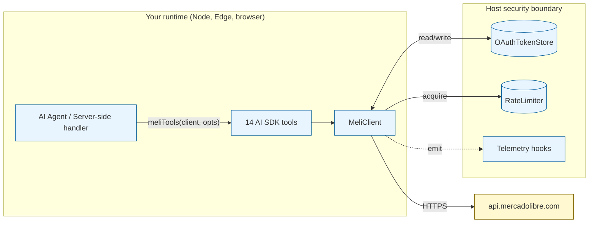
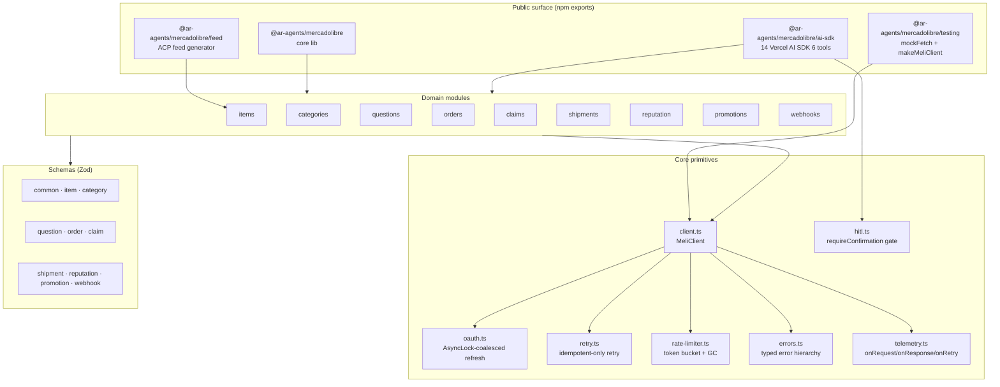

# Architecture — `@ar-agents/mercadolibre`

> What's inside, why it's shaped this way, and where things plug in.

## System context



The lib is a **transport layer**. Adopters bring their own:

- OAuth token persistence (Postgres / Redis / KV / Durable Objects — see [Cookbook 01](./cookbook/01-oauth-setup.md))
- Rate-limiter implementation if they need cross-process semantics (the in-memory token bucket works for single-process)
- Telemetry sink (OTel / Sentry / Datadog / custom) via the hooks at `client.telemetry`

We don't ship a database, a queue, or a logger. We ship the typed surface against MELI's API.

## Layered architecture



## Module responsibility map

| Module | Lines | Responsibility |
| --- | --- | --- |
| `client.ts` | ~360 | HTTP pipeline: auth → rate-limit → retry → request → parse → validate → return |
| `oauth.ts` | ~250 | Authorization-URL builder, code exchange, mutex-coalesced refresh, in-memory store |
| `retry.ts` | ~150 | Exponential backoff, idempotent-only retry classifier, Retry-After parsing |
| `rate-limiter.ts` | ~120 | Token bucket per scope, idle GC, sweep every N acquires |
| `errors.ts` | ~120 | `MeliApiError` with `meliCode/meliMessage/meliCauses/isRateLimited()/isForbidden()/etc` |
| `hitl.ts` | ~110 | Programmatic gate on irreversible operations |
| `telemetry.ts` | ~95 | Hooks: onRequest, onResponse, onRetry, onRateLimitWait. Never headers / bodies. |
| `feed.ts` | ~210 | ACP product feed builder (snapshot / streaming / per-page) |
| `items.ts` | ~280 | get / multiget (chunked) / create / update / pause / close / relist / search / iterate |
| `categories.ts` | ~150 | predict / discover / technical-specs / categorizeAndPlan helper |
| `questions.ts` | ~190 | list / answer / blacklist / unblock + heuristic spam classifier |
| `orders.ts` | ~120 | search / get / billing-info / packs / partitionByPack |
| `claims.ts` | ~225 | search / get / evidences / messages / review / **defendClaim** (sequential) |
| `shipments.ts` | ~120 | get / history / labels (PDF/ZPL via fetchRaw) / shipping-options |
| `reputation.ts` | ~245 | snapshot / **evaluateReputationAlerts** / **monitorReputation** generator |
| `promotions.ts` | ~190 | list candidates / opt-in / **autoOptInPromotions** with margin guard |
| `webhooks.ts` | ~150 | parse / extractResourceId / replayMissedFeeds / iterateAllMissedFeeds (deduped) |
| `ai-sdk.ts` | ~440 | 14 Vercel AI SDK 6 tools, HITL-wrapped where destructive |

Total: ~3500 lines of TypeScript, plus 142 tests across 16 files.

## Trust boundaries

```mermaid
flowchart LR
    user[End user / agent prompt]
    agent[Agent runtime]
    lib[@ar-agents/mercadolibre]
    meli[api.mercadolibre.com]

    user -->|untrusted| agent
    agent -->|trusted| lib
    lib -->|"trusted (HTTPS + Zod)"| meli

    classDef untrusted fill:#fff5f5,stroke:#cc0000
    classDef trusted fill:#f5fff5,stroke:#006600
    class user untrusted
    class agent,lib,meli trusted
```

The lib treats:

- **End-user input** as untrusted. Goes through Zod validation at the AI SDK tool boundary.
- **Agent runtime** as trusted (it controls OAuth tokens, COGS table, evidence files).
- **MELI API** as partially trusted. We always Zod-validate response shapes; we never `eval` or `import()` content from responses.
- **Webhook deliveries** as untrusted. `parseWebhook` rejects malformed bodies; property-tested against random fuzz inputs.

See [SECURITY.md](./SECURITY.md) for the full threat model.

## Why each design choice

- **Why `MeliClient` instead of free functions everywhere?** State (rate-limit buckets, OAuth tokens, telemetry config) belongs in one place per (seller, runtime) pair. Free functions would force every call site to pass that state through.
- **Why Zod instead of pure TypeScript types?** MELI's API evolves. Static types at boundaries catch programmer errors but not schema drift; runtime validation catches drift the moment a response shape changes.
- **Why subpath exports (`/ai-sdk`, `/feed`, `/testing`)?** Tree-shaking. A consumer that only uses the core lib doesn't pay for AI SDK tooling. ESM + CJS dual-emit so older toolchains aren't excluded.
- **Why `defendClaim` sequential and not parallel?** MELI's evidences endpoint has one-shot semantics — concurrent uploads can persist some + reject others, half-defending the claim. See [`claims.ts:202`](./src/claims.ts).
- **Why retry only idempotent verbs by default?** MELI's gateway can split-brain (persist a request + 5xx the response). Retrying POST on 5xx creates duplicates. See [`retry.ts:40`](./src/retry.ts).
- **Why HITL programmatic instead of system-prompt?** LLMs can ignore prompts. They can't ignore a function call that doesn't fire.
- **Why ACP feed opt-in?** Default-open feeds enable disintermediation of MELI by buyer agents. The seller has to explicitly choose that tradeoff.

## Where things will probably change

- **Distributed-lock primitive on `OAuthTokenStore`.** Currently the impl tracks last-read in-memory. A `refreshTransaction()` method would let multi-instance hosts plug in Redis SETNX / Postgres `SELECT FOR UPDATE` / Cloudflare DO RPC.
- **Built-in OpenTelemetry adapter.** Today the telemetry hooks are pluggable; we'd ship a thin OTel adapter at `/telemetry/otel` to remove boilerplate.
- **More AI SDK tools** for the `pause_item`, `close_item`, `opt_in_promotion`, `blacklist_asker` operations (currently lib-only, not exposed as tools).
- **HITL-wrapped tool composition guards.** Today HITL is per-tool; chained sequences (e.g., `create_item` → `defend_claim`) could trigger a higher-severity confirmation.

These are tracked at the GitHub Discussions board.
