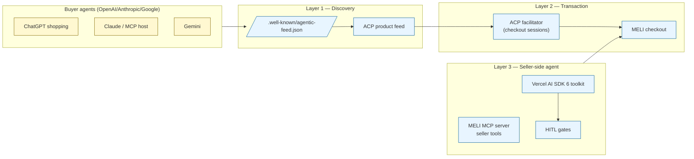

# RFC 001 — Argentine Agentic Commerce 2027

> **Author:** Nazareno Clemente · **Status:** Draft for public comment · **Last revised:** 2026-05-09 · **License:** CC BY 4.0

## Summary

By Q4 2027, between 13% and 20% of LATAM retail intent (Forrester / Flywheel projections) will route through agent intermediaries — ChatGPT Instant Checkout, Claude shopping flows, Gemini's product graph. The marketplaces that emit a controlled, opt-in agent feed and integrate with the Agentic Commerce Protocol (ACP) will retain the relationship; the ones that don't will be disintermediated as scrape targets.

This RFC proposes a concrete architecture for Argentine marketplaces — primarily Mercado Libre, secondarily Tiendanube + Falabella + Magalu — to participate in agentic commerce **without** ceding the marketplace-buyer relationship to OpenAI, Anthropic, or Stripe.

## Why now

Three converging signals.

### 1. Buyer-side agent shipping is real, not hypothetical.

- **OpenAI Instant Checkout** shipped September 2025 with Etsy + Shopify. ([source](https://openai.com/index/buy-it-in-chatgpt/)) The protocol stack is OpenAI + Stripe ACP `2026-04-17`.
- **Anthropic** has shipped MCP-driven shopping demos through partner builds (June 2025).
- **Google's Gemini** is indexing product feeds against `Schema.org/Product` for buyer-intent queries.

These aren't research demos. They're production payment surfaces with millions of monthly users.

### 2. Mercado Libre's CEO has publicly committed to agentic commerce.

In MELI's Q4 2025 earnings call (Feb 26 2026), CEO Ariel Szarfsztejn said:

> "We are developing our own agentic experience inside MercadoLibre… agentic commerce could mean that retail will move even faster from offline to online."

CTO/COO Daniel Rabinovich hosts a podcast called *"Visión AI del CTO"* and has spoken publicly about AI threats to the marketplace.

But Mercado Libre's public agent surface, as of May 2026, exposes only one MCP tool: `search_documentation`. The seller-side agent tools needed to compete with Tiendanube's Lumi and Mercado Pago's Claude Code marketplace are not shipped.

### 3. Tiendanube launched Lumi at InovA 2026.

Direct LATAM marketplace competitor with an AI assistant for sellers and a WhatsApp checkout (NuvemChat). Tiendanube reported R$65 billion in sales and is moving aggressively into the AI-friendly platform positioning.

The empty space between "MELI sellers asking ChatGPT to write their listings" and "MELI ratifying that workflow" is competitive territory Tiendanube is happy to occupy.

## Architecture

The RFC proposes three layers, all of which can be shipped today and most of which already exist as open-source reference implementations.

### Layer 1 — Discovery (the agent-side defense)

**Specification:** A controlled ACP feed at `/.well-known/agentic-feed.json` that:

- Advertises the marketplace's preference for routing buyers through native checkout (`checkout.preferred = true`).
- Defaults to opt-in (`opt_in_required = true`); only sellers who explicitly elect to expose their catalog show up.
- Returns paginated `FeedProduct` entries that include the marketplace's deep-link as `permalink` so even unaffiliated agents prefer routing through MELI's web view.

**Reference implementation:** [`@ar-agents/mercadolibre/feed`](https://www.npmjs.com/package/@ar-agents/mercadolibre) ships this today. Wired live at [`bridge-hello.ar-agents.ar/.well-known/agentic-feed.json`](https://bridge-hello.ar-agents.ar/.well-known/agentic-feed.json).

### Layer 2 — Transaction (the routing-back surface)

**Specification:** An ACP facilitator at `/api/acp/checkout_sessions` that:

- Accepts the buyer agent's checkout request per ACP `2026-04-17`.
- Resolves the cart against MELI's actual inventory + price + shipping data.
- Returns a session that — critically — runs the actual capture **inside MELI's checkout / Mercado Pago / Mercado Envíos rails**, not via a third-party Stripe checkout.

This is the architectural difference between MELI participating in agentic commerce (transaction stays in MELI) vs being scraped (transaction goes to Stripe).

**Reference implementation:** [`@ar-agents/agentic-commerce-bridge`](https://github.com/ar-agents/ar-agents/tree/main/packages/agentic-commerce-bridge) — the bridge package that mounts the 5 ACP endpoints. Live at [`bridge-hello.ar-agents.ar/.well-known/acp.json`](https://bridge-hello.ar-agents.ar/.well-known/acp.json).

### Layer 3 — Seller-side agent (the merchant-side complement)

**Specification:** An expanded MCP server / AI SDK toolkit covering the seller-relevant API surface — items, categories, questions, orders, claims, shipments, reputation, promotions, webhooks. With HITL gates on irreversible operations.

**Reference implementation:** [`@ar-agents/mercadolibre`](https://www.npmjs.com/package/@ar-agents/mercadolibre) (this package). 14 tools shipped, 142 tests, MIT-licensed, ready to extend MELI's existing [`mercadolibre/mercadolibre-mcp-server`](https://github.com/mercadolibre/mercadolibre-mcp-server).

## Adoption paths for Argentine marketplaces

This RFC isn't just for Mercado Libre. The same architecture applies to:

| Marketplace | Adoption complexity | Strategic value |
| --- | --- | --- |
| **Mercado Libre** | Medium — already has Verdi internally + 1 MCP server. Extending requires agent-tool surface decisions + marketplace-buyer relationship policy. | High — largest LATAM marketplace; disintermediation cost is substantial. |
| **Tiendanube** | Low — already shipping Lumi; adding ACP feed + MCP is incremental. | High — closing the Argentine + Brazilian SMB gap. |
| **Falabella / Magalu** | High — older platforms, less internal AI infrastructure. | Medium — defensive against MELI + Tiendanube. |
| **Cabify (services)** | Low — single-action APIs (request a ride). | Medium — would be a differentiator vs Uber. |

## What the existing public ecosystem provides today

| Layer | Open-source reference | Test coverage | Production-deployed |
| --- | --- | --- | --- |
| ACP feed generator | `@ar-agents/mercadolibre/feed` | 10 unit + property tests | ✓ ([live](https://bridge-hello.ar-agents.ar/api/feed/products)) |
| ACP facilitator | `@ar-agents/agentic-commerce-bridge` | 164 unit tests | ✓ ([live](https://bridge-hello.ar-agents.ar/.well-known/acp.json)) |
| MELI seller SDK + AI SDK 6 tools | `@ar-agents/mercadolibre` | 142 tests | ✓ ([npm](https://www.npmjs.com/package/@ar-agents/mercadolibre)) |
| MCP server | `@ar-agents/mcp` | 34 tests | ✓ ([npm](https://www.npmjs.com/package/@ar-agents/mcp)) |

These are MIT-licensed, npm-published, daily-tested against MELI's live public API, and architectural-ready for marketplace ratification. None require a vendor contract; all could be co-maintained, forked, or licensed.

## Open questions for the comment period

1. **Marketplace-side authentication.** Buyer agents need to authenticate cart resolutions against the seller's prices + inventory. Today this works through the ACP facilitator with seller credentials. Should there be a marketplace-issued buyer-agent token for higher-trust flows?

2. **Compliance with Argentine "Defensa del Consumidor" Law 24.240.** Agent-driven purchases need to satisfy the buyer's right to a 10-day return window. Who is the legal buyer of record — the agent, the user, or the agent operator? Open question.

3. **Mercado Pago integration.** ACP `2026-04-17` assumes Stripe-style payment_intents. Mercado Pago's Subscriptions API has a different shape. A LATAM-localized ACP profile may be needed.

4. **Sandbox / testing infrastructure.** None of the LATAM marketplaces today provide an agent-friendly sandbox. Adopting this architecture would benefit from a public sandbox mode with rate-limited test credentials.

5. **Trademark + co-branding.** When a community-built reference implementation gets ratified by a marketplace, what's the co-branding pattern? See [Stripe's Community SDKs](https://docs.stripe.com/sdks/community) for an existing template.

## Comment + collaborate

This RFC is a draft for public comment. The text above is intentionally specific — the right way to argue with it is to point at a section and say "this is wrong because…", not to reject the framing.

- **GitHub Discussions** at [github.com/ar-agents/ar-agents/discussions](https://github.com/ar-agents/ar-agents/discussions)
- **Direct contact** at `naza@helloastro.co` subject `[rfc-001]`
- **Public canonical URL** at [mercadolibre.ar-agents.ar/rfc/001](https://mercadolibre.ar-agents.ar/rfc/001)

If you're at a LATAM marketplace and want to evaluate this for ratification, see [`POSITIONING.md`](../POSITIONING.md) for the strategic argument and [`/integrate`](https://mercadolibre.ar-agents.ar/integrate) for the three adoption paths (try / partner / license).

## Citations

- Mercado Libre Q4 2025 earnings call transcript (Motley Fool): https://www.fool.com/earnings/call-transcripts/2026/02/26/mercadolibre-meli-q4-2025-earnings-transcript/
- OpenAI Instant Checkout launch (Sept 2025): https://openai.com/index/buy-it-in-chatgpt/
- Stripe Agentic Commerce Protocol announcement: https://stripe.com/newsroom/news/stripe-openai-instant-checkout
- Verdi (MELI internal LLM platform) case study: https://openai.com/index/mercado-libre/
- Mercado Pago Claude Code marketplace: https://github.com/mercadopago/mercadopago-claude-marketplace
- Mercado Libre official MCP server: https://github.com/mercadolibre/mercadolibre-mcp-server
- Tiendanube Lumi launch coverage: https://exame.com/negocios/com-r-65-bilhoes-em-vendas-nuvemshop-aposta-em-ia-e-mira-novo-publico/
- Forrester analyst commentary on agentic commerce: https://www.geekwire.com/2025/ai-agents-are-coming-for-your-shopping-cart-how-agentic-commerce-could-disrupt-online-retail/
- Flywheel projection on ChatGPT-driven retail: https://www.flywheeldigital.com/blog/chatgpt-top-10-global-retail-future-brands-strategy
